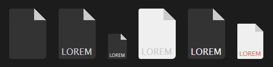

FileIcon
========

FileIcon is a full CSS configurable file icon.

Usage
-----
    <!-- Default -->
    <i data-fi=""></i>
    <!-- Default with text -->
    <i data-fi="lorem"></i>
    <!-- Change size -->
    <i data-fi="lorem" style="font-size:50%"></i>
    <!-- Change background color -->
    <i data-fi="lorem" style="background:#efefef"></i>
    <!-- Change font color -->
    <i data-fi="lorem" style="color:#efefef"></i>
    <!-- Combine options -->
    <i data-fi="lorem" style="font-size:70%;background:#efefef;color:tomato"></i>
    
Output:

